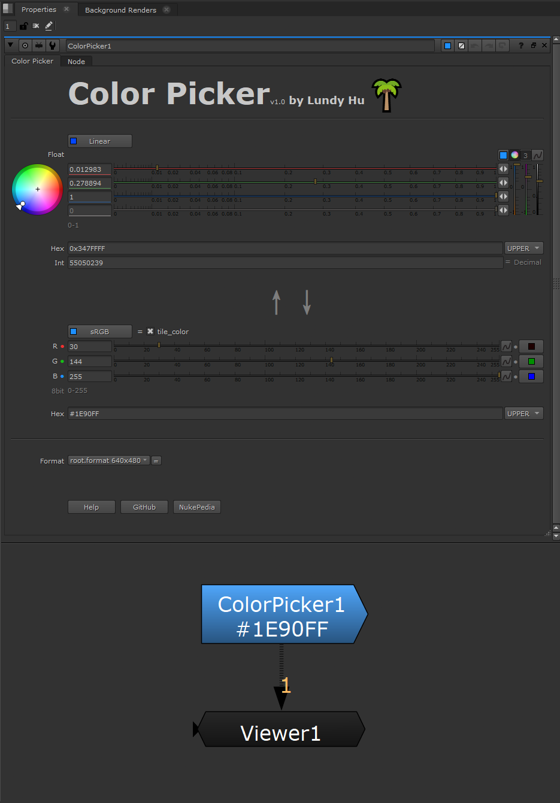

<h1 align="center">
  
   ColorPicker 
</h1>

The ColorPicker gizmo for Nuke.

- You can get the color format you want for nuke or html, including hex, decimal, float.  
(RGB to Hex or Hex to RGB)

- The node is completely controlled by python code.
You only need to change one color parameter at will, all other knobs are dynamically linked and live update.

